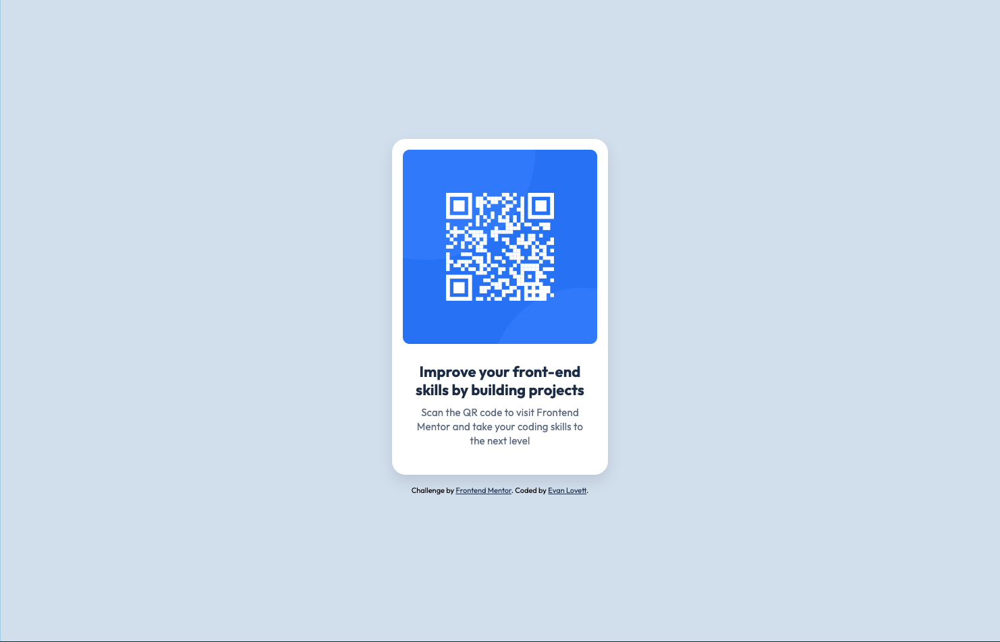

## Table of contents

- [Overview](#overview)
  - [Screenshot](#screenshot)
  - [Links](#links)
- [My process](#my-process)
  - [Built with](#built-with)
  - [What I learned](#what-i-learned)
  - [Useful resources](#useful-resources)

**Note: Delete this note and update the table of contents based on what sections you keep.**

## Overview

Hello!👋 This QR Code Component is a challenge from Frontend Mentor. Feel free to click the links below to compare the challenge's design vs. my solution.

This challenge was completed purely with HTML/CSS.

### Screenshot

### Links

- Solution URL: [Add solution URL here](https://your-solution-url.com)
- Live Site URL: [https://qr-code-component-mauve-omega.vercel.app/](https://qr-code-component-mauve-omega.vercel.app/)

## My process

My process for this challenge was quite simple. First, I outlined the HTML elements and filled in the content that was necessary to complete the solution. Then, I added class names to the elements that I knew would need styling - however, this changed slightly as I was coding the CSS. Then, I went to work on styling using CSS, referencing the Figma design for the various styles.

### Built with

- Semantic HTML5 markup
- CSS custom properties

### What I learned

This was a great refresher on basic HTML/CSS. For my day job I typically use MUI components - so, although the CSS is syntactically similar, it was great to get back to the roots and write basic CSS outside of an `sx` prop.

### Useful resources

- [px-to-rem converter](https://nekocalc.com/px-to-rem-converter) - This converter helped we convert the fontsizes based in px on the Figma file to rem so that the page respects the user's text size preferences. 
